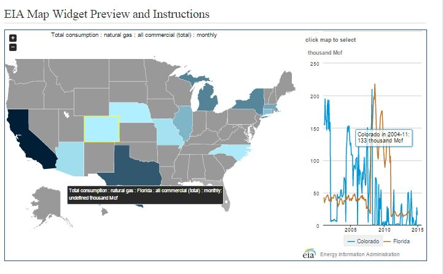
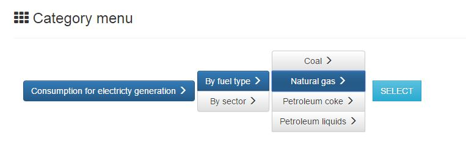
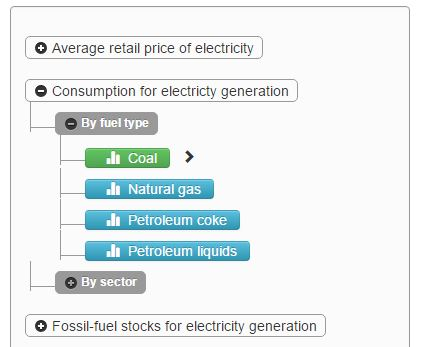

# EIA Data Explorer

Shows multiple maps and charts, sourced from the U.S. Energy information Administration (EIA). It enables users to compare between different categories and find interesting details.

## How this App works

### 1. API and widgets by EIA
EIA offers open data with these categories through [their API.](http://www.eia.gov/beta/api/index.cfm)
This App currently covering only parts of Electricity section.

 * Electricity
 * State Energy Data System (SEDS)
 * Petroleum
 * Natural Gas
 * Total Energy
 * Coal
 * Short-Term Energy Outlook
 * Annual Energy Outlook
 * Crude Oil Imports
 * International Energy Data


#### API Category Query 
The Category Query is a tree structure, and App requests with parent category_id and the query returns child category_ids.

 * [API Documentation](http://www.eia.gov/beta/api/commands.cfm)
 * [Query Browser](http://www.eia.gov/beta/api/qb.cfm)
    
Sample Data of API Category Query
```json
        {
        "request":{
        "category_id":0,
        "command":"category"
        }
        "category":{
        "category_id":"0",
        "parent_category_id":"371",
        "name":"Electricity",
        "notes":"",
        "childcategories":[
        {"category_id":"1","name":"Net Generation"},
        {"category_id":"1017","name":"Power Plant Level Data"},
        ...
        ],
        "childseries":[]
        }
        }
```
    
#### EIA Widgets
By putting this code inside HTML, their widget imports graphs and charts automatically. What we have to do to get charts and maps is only define Geoset_id.
    
```html
    <div class="eia-visualization" map="us_merc_en" initial_regions="" geoset_id="ELEC.CONS_TOT.NG-96.M" relation_mode="line" style="width: 915px; height: 500px"></div>
```
    
 * [Widget example](http://www.eia.gov/beta/api/embed.cfm?type=map&geoset_id=ELEC.CONS_TOT.NG-96.M&tracking_regions=USA-AZ)

<p align="center">
    
</p>


### 2. Structure
To load tree menu smoothly, it stores category data to the database in advance. Then Django framework load the data from database to show tree menu.

```
    [EIA API]
        |
        | < Get category data and update DB by getcategory.py
        | < Extract Getset_id
        |
    [Database(SQLite)]
        |
        | < load category data and Getset_id  
        |
        |
    [Django] 
        L (home.html)
        L (index.html)
        L (detail.html) <-----Widget-----[EIA API]
```

### 3. Get category data
To update hierarchical category data on the database, it flatten the category data as bellow.

API Query Example

> * API Query #1     
>Parent: Category_A</br>
>Child: Category_B, Category_C

> * API Query #2           
>Parent: Category_B</br>
>Child: Category_E, Category_F

> * API Query #3           
>Parent: Category_E</br>
>Child: Category_H</br>
>Child_Series_id: ELEC.SALES.ALL.A <- original of Getset_id  

##### After flattened
Scategory Table:

| Series_id  | Child1 | Child2 | Child3 | Child4 |
| ------------- | ------------- | ------------- | ------------- | ------------ |
| ELEC.SALES.ALL.A  | Category_A  | Category_B   | Category_E   | Category_H

MetaCategory Table:

| Category_id  | name |
| ------------- | ------------- | 
| Category_A  | Electricity |
| Category_B | Total Consumption |
| Category_E | By Sector |
| Category_H | Natural Gas |


### 4. Extract Getset_id

There is no API query for getting 'Geoset_id'. It extracts 'Geoset_id' from 'Series_id' in 'getcategory.py' as bellow.

| Series_id  | Geoset_id |
| ------------- | ------------- | 
|ELEC.CONS_TOT.COW-**AL**-99.A | ELEC.CONS_TOT.COW-99.A
|ELEC.REV.**AK**-ALL.Q| ELEC.REV.ALL.Q|

"AL-" and "AK-" defines the states as filter.
To get 'Geoset_id', it removes the states filter, "XX-" from 'Series_id'.

This code gets 'Series_id' from database, replace "XX-" by Regex, and update to 'Geoset_id'.
```python
    sql = 'SELECT series_id, geoset_id FROM graphs_scategory'
    keys = [];
    for row in c.execute(sql):
        keys.append(row);
    #create geoset_id
    p = re.compile("[A-Z]*-([0-9A-Z]*\.)[A|M|Q]")
    for key in keys:
        sql=('UPDATE graphs_scategory SET geoset_id = ?'
         + 'WHERE series_id = ?')
        geoset_id = p.sub(r"\1A", key[0])
        args = [geoset_id] + [key[0]]
        c.execute(sql,args)
```


### 5. Django
Main programs

 * models.py

```python

class Scategory(models.Model):
    series_id = models.CharField(primary_key=True, max_length=100)
    category1 = models.ForeignKey('MetaCategory', related_name='category1', null=True)
    category2 = models.ForeignKey('MetaCategory', related_name='category2', null=True)
    category3 = models.ForeignKey('MetaCategory', related_name='category3', null=True)
    category4 = models.ForeignKey('MetaCategory', related_name='category4', null=True)
    category5 = models.ForeignKey('MetaCategory', related_name='category5', null=True)
    geoset_id = models.CharField(max_length=100, null=True)

    def __unicode__(self):
        return self.series_id

class MetaCategory(models.Model):
    category_id = models.IntegerField(primary_key=True)
    name = models.CharField(max_length=255)

    def __unicode__(self):
        return self.name
```


 * urls.py
 
 
```python
urlpatterns = [
    url(r'^$', views.HomePageView.as_view(), name='home'),
    url(r'^index/$', views.IndexView.as_view(), name='index'),
    url(r'^(?P<pk>[A-Z]+.*)/$', views.DetailView.as_view(), name='detail')
]
```

* views.py


```python
class HomePageView(TemplateView):
    template_name = 'home.html'

class IndexView(generic.ListView):
    template_name = 'graphs/index.html'
    context_object_name = 'category_list'

    def get_queryset(self):
        #group by Series_id
        return Scategory.objects.values("category1__name",
            "category2__name",
            "category3__name",
            "category4__name",
            "category5__name",
            "category1",
            "category2",
            "category3",
            "category4",
            "category5",
            ).annotate(series_id=Min('series_id'))

class DetailView(generic.DetailView):
    template_name = 'graphs/detail.html'
    model = Scategory
```

### 6. Navigation

There was the prototype made by vertical buttons with bootstrap.

<p align="center">
    
</p>

However, it didn't have a good operational feeling, so I re-built it based on [Bootstrap-Themed Tree Widget](http://jhfrench.github.io/bootstrap-tree/docs/example.html)

<p align="center">
    
</p>

### 7. Loading widget

Maps and Charts in [EIA Widget](http://www.eia.gov/beta/api/embed.cfm?type=map&geoset_id=ELEC.CONS_TOT.NG-96.M&tracking_regions=USA-AZ) build by [Highcharts.com](http://www.highcharts.com/).

I edited "EIA_grapher.js" comes with EIA widgets for adjusting the size of the map and title to fit them in the page.